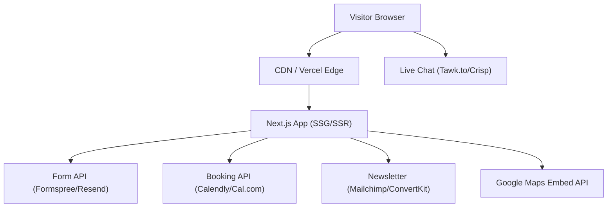

# Design Document: Texas Home Construction Website

## Overview

Texas Home Construction needs a modern, conversion-optimized marketing website built as a static or server-rendered multi-page site. The primary goals are lead generation (quote requests, consultation bookings), trust building (portfolio, testimonials, certifications), and organic search visibility (SEO).

The site will be built with Next.js (React) using the App Router, styled with Tailwind CSS, and deployed as a static export or on a Node.js host. This stack provides excellent SEO support via server-side rendering, fast performance, and a strong ecosystem for the required features (image optimization, sitemap generation, structured data).

Key design decisions:
- **Next.js App Router** — enables per-page metadata, static generation, and server components for SEO
- **Tailwind CSS** — utility-first styling makes it straightforward to enforce the brand design system
- **Calendly embed or Cal.com** — handles booking availability, confirmation emails, and slot management without building a custom scheduler
- **Formspree or Resend** — handles contact form submission and email delivery without a custom backend
- **Tawk.to or Crisp** — provides the live chat widget as a third-party embed, satisfying the 30-second response requirement via their agent routing
- **next-sitemap** — generates `/sitemap.xml` and `robots.txt` automatically at build time

---

## Architecture



The site is primarily static — all pages are pre-rendered at build time. Dynamic behavior (form submission, booking, chat) is handled by third-party APIs called from the browser or lightweight Next.js API routes.

### Page Structure

```
/                   → Homepage (all major sections as scroll targets)
/services           → Expanded services detail page
/portfolio          → Full portfolio gallery page
/about              → Team detail page
/privacy-policy     → Legal page
/terms-of-service   → Legal page
/sitemap.xml        → Auto-generated XML sitemap
/robots.txt         → Auto-generated robots file
```

The homepage contains anchor-linked sections: `#hero`, `#services`, `#about`, `#portfolio`, `#testimonials`, `#contact`.

---

## Components and Interfaces

### Layout Components

**`Header`**
- Props: `currentPath: string`
- Renders: logo (left), nav links, "Get a Quote" CTA button
- Behavior: sticky on scroll; collapses to hamburger menu below `md` breakpoint (768px)
- "Get a Quote" scrolls to `#contact` or navigates to `/#contact`

**`Footer`**
- Props: none (static content)
- Renders: nav links, Privacy Policy / Terms links, social icons, newsletter signup form
- Newsletter form calls `/api/newsletter` route which proxies to mailing list provider

**`MobileNav`**
- Props: `isOpen: boolean`, `onClose: () => void`
- Renders: full-screen overlay with vertical nav links

### Section Components (Homepage)

**`HeroSection`**
- Full-width background image with overlay
- Headline, subheadline, "View Our Services" CTA (scrolls to `#services`)
- Image served via `next/image` with priority loading for LCP

**`ServicesSection`**
- Introductory paragraph + responsive grid of service cards
- Each `ServiceCard`: icon (SVG), title, short description
- "Learn More About Our Services" CTA → `/services`
- Grid: 4 columns on desktop, 2 on tablet, 1 on mobile

**`AboutSection`**
- Company history + mission statement text
- Team/project image via `next/image`
- "Meet Our Team" CTA → `/about`

**`PortfolioSection`**
- Responsive image grid (3 cols desktop, 2 tablet, 1 mobile)
- Each `PortfolioCard`: thumbnail, project title, brief description
- Click opens `Lightbox` component
- "See More Projects" CTA → `/portfolio`

**`Lightbox`**
- Props: `images: PortfolioImage[]`, `activeIndex: number`, `onClose: () => void`
- Renders: full-screen overlay, large image, prev/next controls, close button
- Traps focus; closes on Escape key

**`TestimonialsSection`**
- Auto-advancing carousel (3-second interval)
- Each slide: quote text, client name, optional photo
- Manual prev/next controls
- "Read More Reviews" CTA (links to Google Reviews or review aggregator)

**`ContactSection`**
- `ContactForm` component + company info + Google Maps embed
- Booking widget embed (Calendly/Cal.com inline embed)

**`ContactForm`**
- Fields: Name, Email, Phone Number, Message (all required)
- Client-side validation with inline error messages
- On submit: POST to `/api/contact` → Formspree/Resend
- Success: displays confirmation message; error: displays error message

**`TrustSignals`**
- Row of certification/affiliation logos
- Each logo is an anchor opening the certification page in a new tab
- Positioned above the fold on homepage (between Hero and Services, or within Hero)

**`BookingWidget`**
- Inline embed of Calendly or Cal.com
- Accessible from Contact section and from "Get a Quote" CTA

### Page Components

**`ServicesPage`** (`/services`) — detailed service descriptions, pricing tiers (optional), CTA
**`PortfolioPage`** (`/portfolio`) — full gallery with filtering by project type
**`AboutPage`** (`/about`) — team bios, company timeline
**`PrivacyPolicyPage`**, **`TermsPage`** — static legal content

### Utility / Infrastructure

**`/api/contact`** — Next.js API route; validates payload, forwards to Formspree/Resend
**`/api/newsletter`** — Next.js API route; validates email, subscribes to mailing list
**`next-sitemap`** — post-build script generating `sitemap.xml` and `robots.txt`
**`schema.ts`** — exports `LocalBusiness` JSON-LD object for homepage structured data

---

## Data Models

### PortfolioImage

```typescript
interface PortfolioImage {
  id: string;
  src: string;           // path or URL to full-size image
  thumbnail: string;     // path or URL to thumbnail
  alt: string;           // descriptive alt text (required for SEO/a11y)
  title: string;
  description: string;
  category: 'residential' | 'commercial' | 'remodeling' | 'custom';
}
```

### Testimonial

```typescript
interface Testimonial {
  id: string;
  clientName: string;
  quote: string;
  photoSrc?: string;     // optional client photo
  photoAlt?: string;
}
```

### ServiceCard

```typescript
interface ServiceCard {
  id: string;
  icon: string;          // SVG component name or path
  title: string;
  description: string;
}
```

### ContactFormPayload

```typescript
interface ContactFormPayload {
  name: string;          // required, non-empty
  email: string;         // required, valid email format
  phone: string;         // required, non-empty
  message: string;       // required, non-empty
}
```

### NewsletterPayload

```typescript
interface NewsletterPayload {
  email: string;         // required, valid email format
}
```

### BrandConfig

```typescript
const brand = {
  colors: {
    primary: '#1e2330',   // Deep Slate Blue — headers, CTAs
    gray: '#818181',      // Medium Gray — backgrounds, body text
    accent: '#FFA500',    // Bright Orange — buttons, highlights
  },
  fonts: {
    heading: 'SQMarket-Medium, sans-serif',
    body: 'Arial, Helvetica, sans-serif',
  },
} as const;
```

### PageMetadata

```typescript
interface PageMetadata {
  title: string;          // unique per page
  description: string;    // unique meta description per page
  canonicalUrl: string;
}
```

---


## Correctness Properties

*A property is a characteristic or behavior that should hold true across all valid executions of a system — essentially, a formal statement about what the system should do. Properties serve as the bridge between human-readable specifications and machine-verifiable correctness guarantees.*

### Property 1: WCAG AA Contrast for Hero Text

*For any* combination of overlay text color and background color used in the Hero section, the computed contrast ratio must be at least 4.5:1 for normal text and 3:1 for large text, as defined by WCAG AA.

**Validates: Requirements 2.6**

---

### Property 2: Service Cards Contain Icon and Description

*For any* service card rendered in the Services section, the rendered output must contain both an icon element and a non-empty description string.

**Validates: Requirements 3.2**

---

### Property 3: Portfolio Items Include Description

*For any* portfolio image item rendered in the Portfolio gallery, the rendered output must include a non-empty project description alongside or beneath the image.

**Validates: Requirements 5.3**

---

### Property 4: Testimonials Include Client Name

*For any* testimonial rendered in the Testimonials carousel, the rendered output must include a non-empty client name string.

**Validates: Requirements 6.1**

---

### Property 5: Carousel Auto-Advances

*For any* testimonials carousel with more than one item, after the configured auto-advance interval elapses, the active index must increment (wrapping around to 0 after the last item).

**Validates: Requirements 6.3**

---

### Property 6: Carousel Manual Navigation

*For any* testimonials carousel with N items, clicking the "next" control must advance the active index by 1 (mod N), and clicking "previous" must decrement it by 1 (mod N).

**Validates: Requirements 6.4**

---

### Property 7: Contact Form Rejects Incomplete Submissions

*For any* subset of required contact form fields (Name, Email, Phone, Message) that are left empty, submitting the form must result in an inline validation error being displayed for each empty field, and the form must not be submitted to the API.

**Validates: Requirements 7.3**

---

### Property 8: Contact Form Rejects Invalid Email

*For any* string that does not conform to a valid email address format, entering it in the Email field and attempting to submit the contact form must result in an inline validation error, and the form must not be submitted to the API.

**Validates: Requirements 7.4**

---

### Property 9: External Links Open in New Tab

*For any* external link rendered on the site (trust signal logos, social media icons, footer links to external pages), the anchor element must have `target="_blank"` and a non-empty `href` attribute.

**Validates: Requirements 9.3, 11.3**

---

### Property 10: Touch Targets Meet Minimum Size

*For any* interactive element (button, link, form control) rendered on the site, the element's effective tap target must be at least 44×44 CSS pixels.

**Validates: Requirements 13.2**

---

### Property 11: Every Page Has Unique Title and Meta Description

*For any* page exported by the Next.js app, the page's metadata object must contain a non-empty `title` string and a non-empty `description` string, and no two pages may share the same title.

**Validates: Requirements 14.1**

---

### Property 12: All Images Have Non-Empty Alt Text

*For any* `` element or `next/image` component rendered anywhere on the site, the `alt` attribute must be a non-empty string.

**Validates: Requirements 14.2**

---

### Property 13: Heading Hierarchy Is Valid on Every Page

*For any* page rendered by the site, the page must contain exactly one `<h1>` element, and all `<h2>` elements must appear after the `<h1>`, and all `<h3>` elements must appear after at least one `<h2>`.

**Validates: Requirements 14.3**

---

### Property 14: Newsletter Form Rejects Invalid Email

*For any* string that does not conform to a valid email address format, entering it in the newsletter signup field and submitting must result in an inline validation error, and the form must not call the subscription API.

**Validates: Requirements 11.6**

---

## Error Handling

### Form Submission Errors

- **Validation errors** (client-side): Displayed inline beneath each invalid field immediately on blur or on submit attempt. The form is never submitted to the API while validation errors exist.
- **Network/API errors** (server-side): If the `/api/contact` or `/api/newsletter` route returns a non-2xx response, the form displays a generic error message ("Something went wrong. Please try again or call us directly.") without exposing internal details.
- **Timeout**: If the API call does not respond within 10 seconds, the form shows the same generic error message.

### Booking Widget Errors

- The Calendly/Cal.com embed handles its own error states (unavailable slots, network issues). The surrounding page provides a fallback message with the company phone number in case the embed fails to load.

### Image Loading Errors

- All `next/image` components include an `onError` handler that swaps to a placeholder image to prevent broken image icons.

### Live Chat Unavailability

- The Tawk.to/Crisp widget handles offline mode natively. No additional error handling is required in the application code.

### Sitemap / robots.txt Generation

- `next-sitemap` runs as a post-build step. If it fails, the build pipeline should surface the error and block deployment.

---

## Testing Strategy

### Dual Testing Approach

Both unit tests and property-based tests are required. They are complementary:
- **Unit tests** verify specific examples, integration points, and edge cases
- **Property tests** verify universal behaviors across many generated inputs

### Unit Tests

Focus areas:
- Rendering each major section component and asserting required content is present (nav links, hero text, service titles, form fields, footer links)
- CTA button href/onClick targets (correct anchor IDs or page routes)
- Contact form success state (mock API returns 200 → confirmation message shown)
- Newsletter form success state (mock API returns 200 → confirmation shown)
- Lightbox opens on portfolio image click and closes on Escape key
- Booking widget embed is rendered within the contact section
- Trust signal logos render with correct hrefs
- Social media icons render with correct hrefs
- Sitemap contains all expected page URLs
- robots.txt does not disallow public pages
- Homepage JSON-LD script tag contains `@type: LocalBusiness`
- Brand config exports correct hex values and font names

Test framework: **Jest** + **React Testing Library**

### Property-Based Tests

Property-based testing library: **fast-check** (TypeScript-native, works with Jest)

Each property test runs a minimum of **100 iterations**.

Each test is tagged with a comment in the format:
`// Feature: texas-home-construction-website, Property {N}: {property_text}`

| Property | Test Description |
|---|---|
| Property 1 | Generate random text/overlay color pairs; assert contrast ratio ≥ 4.5:1 |
| Property 2 | Generate arbitrary ServiceCard data; render; assert icon + description present |
| Property 3 | Generate arbitrary PortfolioImage data; render; assert description present |
| Property 4 | Generate arbitrary Testimonial data; render; assert clientName present |
| Property 5 | Generate N-item testimonial list; advance timer by interval; assert index increments |
| Property 6 | Generate N-item list; click next/prev arbitrary times; assert index = expected (mod N) |
| Property 7 | Generate all non-empty subsets of required fields as empty; submit; assert errors shown, API not called |
| Property 8 | Generate arbitrary non-email strings; enter in email field; submit; assert validation error shown |
| Property 9 | Collect all external link elements from rendered pages; assert each has target="_blank" and non-empty href |
| Property 10 | Collect all interactive elements; assert computed min tap target ≥ 44×44px |
| Property 11 | Enumerate all page metadata exports; assert non-empty title + description, all titles unique |
| Property 12 | Collect all img/Image elements from rendered pages; assert alt is non-empty string |
| Property 13 | Render each page; parse heading elements; assert exactly one H1, H2s follow H1, H3s follow H2 |
| Property 14 | Generate arbitrary non-email strings; enter in newsletter field; submit; assert error shown, API not called |

### Edge Cases (Unit Tests)

- Contact form with all fields empty → errors on all four fields
- Contact form with only whitespace in required fields → treated as empty, errors shown
- Newsletter form with empty string → validation error
- Portfolio gallery with zero items → renders empty state gracefully
- Testimonials carousel with one item → no auto-advance, no prev/next controls shown
- Lightbox with single image → no prev/next navigation
- Hero section image fails to load → placeholder shown
